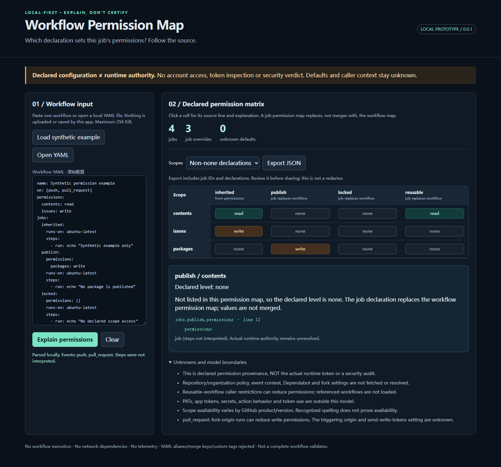

# Workflow Permission Map（v0.1.0 alpha）

工作流写了 `contents: read`，为什么某个 job 却声明为 `none`？
逐格查看 GitHub Actions 权限的声明来源和 YAML 行号。

**[直接试用](https://shkyyy18.github.io/workflow-permission-map/)** |
**[下载离线 HTML](https://github.com/shkyyy18/workflow-permission-map/releases/tag/v0.1.0)** |
[English](README.md)

合成示例无需安装、账号或 token。检查自己的工作流时，先下载 `index.html`，
用同一 Release 的 `SHA256SUMS.txt` 核对 SHA-256，再离线打开。
应用不上传输入、不执行工作流。它解释的是**声明配置**，不是实际运行时 token 权限，也不是安全扫描器。



## 30 秒看懂一个容易误读的规则

1. 打开在线演示，默认是明确标注的四个 job 合成工作流。
2. 找到 `publish / contents`：工作流写了 `contents: read`，这里却是 `none`。
3. 点击该格子，解释指向 `jobs.publish.permissions`，第 12 行。

原因是 job 的权限表**替换**工作流权限表，而不是逐项合并。
只写 `packages: write` 时，表里未列出的权限就是 `none`。
[可复现例子](docs/permission-replacement.md)展示了显式补上 `contents: read` 后的声明差异；
实际运行权限仍受其他条件影响，不可从这个表推断安全结论。

## 反馈

行号解释是否帮助你审查权限变化？可以在 Issue 里描述看不懂的结果，必要时附最小**合成** YAML。
不要贴真实工作流、凭据或私人标识。尚无独立用户验证；公开 alpha 不等于生产可用。

## 从源码构建

构建需要 Node.js 22+；构建完成后只需要现代浏览器。

```sh
npm ci --ignore-scripts
npm test
npm run build
```

打开 `dist/index.html`，无需服务器、账号、token 或联网。默认显示明确标注的合成例子。
粘贴工作流或点 Open YAML 选本地文件，再点 Explain permissions。
点矩阵中的格子，查看权限声明的路径、行号和解释。编辑输入会立即作废旧结果。
Clear 清除输入与结果；应用不主动持久保存数据。

例子：工作流声明 contents: read 和 issues: write，publish job 仅声明 packages: write。
该 job 的 contents 和 issues 就是声明为 none，而非继承上层值。例子不会发布任何包。

## 不会擅自推断的部分

- job 权限表覆盖工作流权限表，不逐项相加；表中遗漏权限为 none。
- 两层都未声明时显示 unknown，不猜仓库默认值。
- read-all / write-all 原样保留为符号策略，不硬展开为可能无效的逐权限读写值。
- 可复用工作流只识别调用，不读取被调用文件；调用链上限仍未知。
- fork、Dependabot、组织/仓库配置、实际事件来源、PAT、App token、脚本行为均未计算。
- 导出含 job 标识和权限声明，不含原始 steps 脚本；它不是脱敏器，分享前仍需检查。
- 应用不上传、不遥测、不执行工作流；浏览器扩展和操作系统不在此保证范围。

## 输入范围

仅单文档 YAML 1.2，最多 256 KiB、200 jobs、30,000 语法节点、40 层深度。
重复键、别名、合并键、显式标签、不认识的权限名/值、空值和权限表达式直接拒绝，
不悄悄省略后继续显示“完整结果”。因此可能拒绝部分 GitHub 支持的合法工作流。
不检查 steps、必填字段、其他位置表达式、事件是否在平台上存在，也不给安全评分。

权限词表来自 2026-10-01 核对的 GitHub 文档源，包含受功能开关限制的字段。
接受字段拼写不代表该权限在特定产品、套餐或版本上可用；新增权限需重新核对。

## 与已有工具的区别只是待验证假设

Actions Permission Diff Ledger 已提供权限与信任边界的前后差异 CLI 和多格式报告。
本原型不重复做扫描器，只尝试“一个离线文件、单份工作流、点格子解释来源”的交互方式。
这种展示方式是否值得独立成项目，仍需真实用户反馈；技术通过不代表有需求或增长。

英文 README 包含完整边界与原始参考链接。代码 MIT；依赖许可见 THIRD_PARTY_NOTICES.txt。

